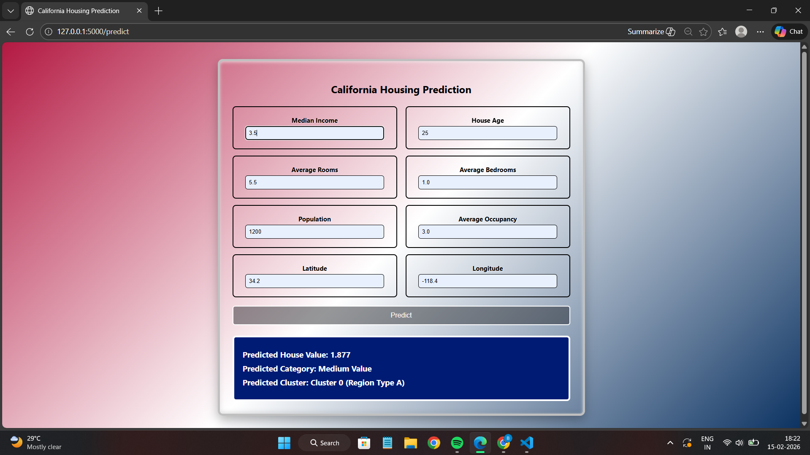
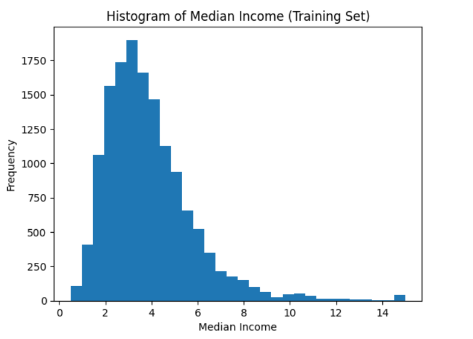
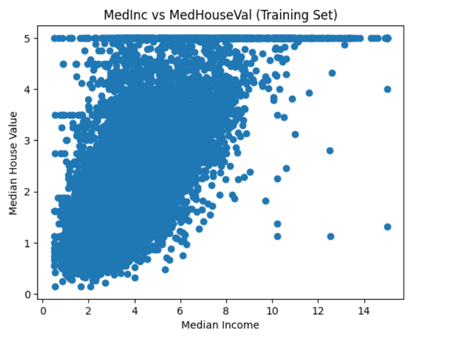
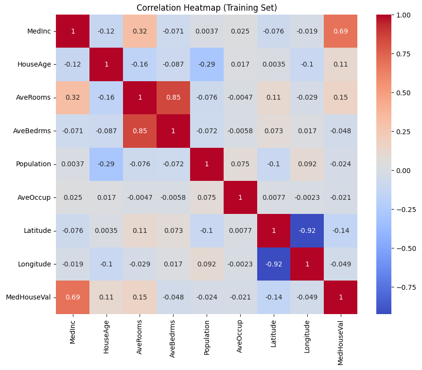

# California Housing Machine Learning Web Application

## Course Information
- Course Code: CS33002  
- Course Name: Applications Development Laboratory  
- Student Name: Raman Buchha  
- Roll Number: 2305959  
- Semester: 6th  
- Instructor: Dr. Murari Mandal  

---

## 📌 Project Overview

This project implements a complete end-to-end Machine Learning pipeline using the California Housing dataset from sklearn.

The application includes:

- Data Preprocessing & EDA
- Regression Models
- Classification Models
- Support Vector Machine
- Neural Network
- Clustering (KMeans)
- Web Deployment using Flask
- Styled Frontend using HTML & CSS

---

## 📊 Learning Tasks Implemented

### 1️⃣ Regression
Predict Median House Value (MedHouseVal)

Model Used:
- Multiple Linear Regression (Final Selected Model)

Evaluation Metrics:
- Mean Squared Error (MSE)
- R² Score

---

### 2️⃣ Classification
Converted MedHouseVal into:
- Low Value (Bottom 33%)
- Medium Value (Middle 33%)
- High Value (Top 33%)

Models Trained:
- Logistic Regression
- Decision Tree
- Random Forest (Final Selected Model)
- Support Vector Machine
- Neural Network (MLP)

Evaluation Metrics:
- Accuracy
- Confusion Matrix
- Precision
- Recall
- F1-score

---

### 3️⃣ Clustering
Grouped housing regions based on socio-economic and geographical features using:

- KMeans Clustering

Evaluation:
- Elbow Method
- Silhouette Score

---

## 🖥️ Web Application Features

The Flask web application allows users to:

- Enter housing features
- Get predicted house value (Regression)
- Get predicted category (Classification)
- Get predicted regional cluster (Clustering)

---

## 📁 Project Structure

2305959_ADL_assignment/
│
├── CS33002_ADL_California_Housing.ipynb
├── models/
│ ├── regression_model.pkl
│ ├── classification_model.pkl
│ ├── clustering_model.pkl
│ ├── scaler.pkl
│ └── thresholds.pkl
│
├── webapp/
│ ├── app.py
│ ├── templates/
│ │ └── index.html
│ └── static/
│ └── style.css
│
├── requirements.txt
└── README.md

---

## ⚙️ Installation & Setup

### 1️⃣ Create Virtual Environment

python -m venv venv

### 2️⃣ Activate Environment (Windows)

venv\Scripts\activate

### 3️⃣ Install Requirements

pip install -r requirements.txt

### 4️⃣ Run Flask App
Navigate to:
cd webapp

Then run:
python app.py

Open browser:
http://127.0.0.1:5000

---

## 🧪 Example Input

Example test values:

| Feature | Value |
|----------|--------|
| MedInc | 4 |
| HouseAge | 30 |
| AveRooms | 6 |
| AveBedrms | 1 |
| Population | 1000 |
| AveOccup | 3 |
| Latitude | 34 |
| Longitude | -118 |

---

## 📸 Screenshots

### 🔹 Prediction Output

### 🔹 Model Evaluation Graphs

## 🛠️ Technologies Used

- Python
- NumPy
- Pandas
- Scikit-learn
- Matplotlib
- Seaborn
- Flask
- HTML/CSS

---

## 📌 Dataset

California Housing Dataset  
Source: `sklearn.datasets.fetch_california_housing()`

---

## 🚀 Project Status

✔ Machine Learning pipeline completed  
✔ Models trained and evaluated  
✔ Web deployment completed  
✔ UI styled using CSS  

---

## 📄 License

Academic submission for CS33002 Applications Development Laboratory.

